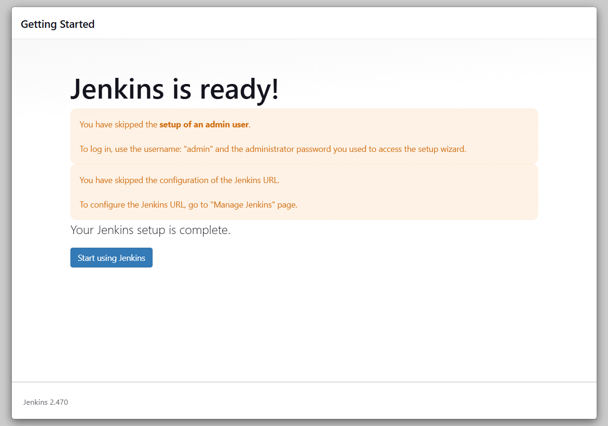
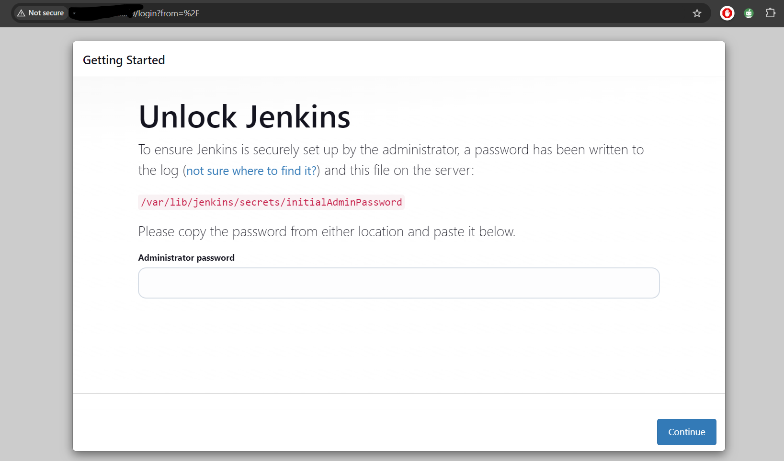
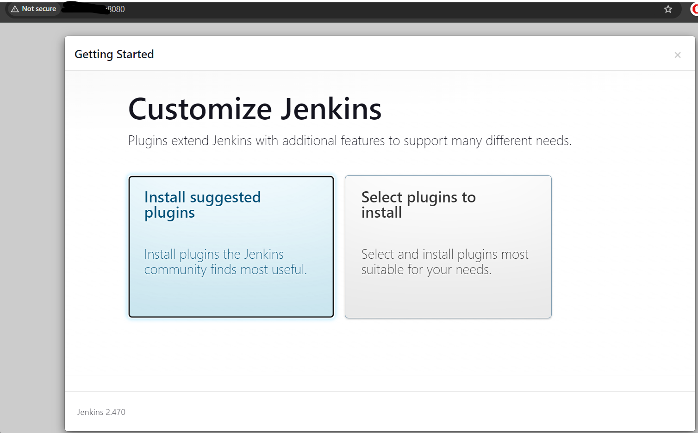

## Create an EC2 instance
- Create an Ubuntu EC2 instance with a security group having inbound rule for protocol 'custom TCP' port '8080' and 'ssh' port '22'

- Install Java JDK

```
sudo apt update
sudo apt install openjdk-17-jre
java --version
```
- To install Jenkins 

```
curl -fsSL https://pkg.jenkins.io/debian/jenkins.io-2023.key | sudo tee \
  /usr/share/keyrings/jenkins-keyring.asc > /dev/null
echo deb [signed-by=/usr/share/keyrings/jenkins-keyring.asc] \
  https://pkg.jenkins.io/debian binary/ | sudo tee \
  /etc/apt/sources.list.d/jenkins.list > /dev/null

sudo apt-get update
sudo apt-get install jenkins
```

- Login to Jenkins Server using the below URL:
http://EC2-Public-IPAdress:8080 (replace with Public IP of your EC2 Instance)



- After you login to Jenkins, run the command to copy the Jenkins Admin Password 

```
sudo cat /var/lib/jenkins/secrets/initialAdminPassword

```
- Enter the Administrator password



- Click on Install suggested plugins



- Create First Admin User or Skip the step

- Jenkins Installation is Successful

- Install the Docker Pipeline plugin in Jenkins:
Log in to Jenkins.
Go to Manage Jenkins > Manage Plugins.
In the Available tab, search for "Docker Pipeline".
Select the plugin and click the Install button.
Restart Jenkins after the plugin is installed.

- Docker Agent Configuration

```
sudo apt update
sudo apt install docker.io

```


- Grant Jenkins user and Ubuntu user permission to docker daemon

```
sudo su - 
usermod -aG docker jenkins
usermod -aG docker ubuntu
systemctl restart docker

```

- Once you complete above steps, restart Jenkins

```
http://ec2-instance-public-ip:8080/restart

```
- The docker agent configuration is now successful.

**Project Credits to - Abhishek Veeramalla**