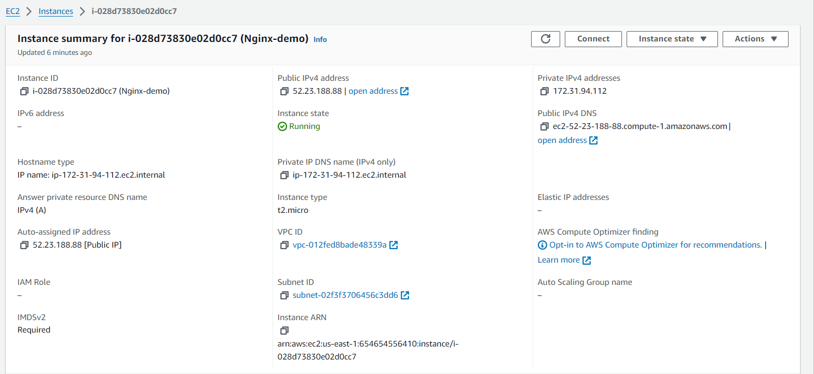
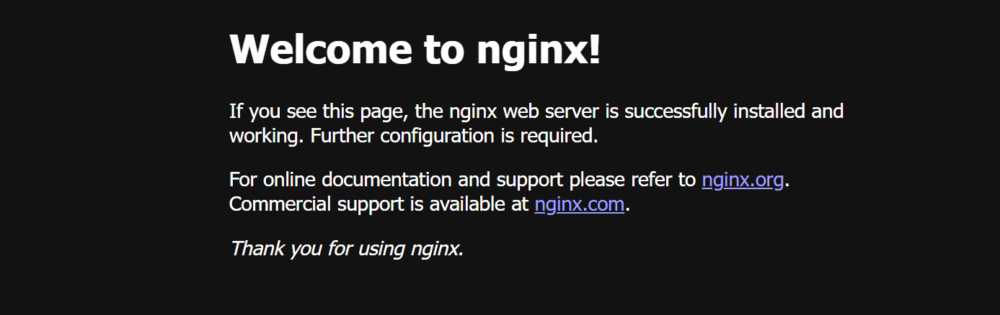

## Install Nginx Server on an EC2 instance

Step 1: Launch an EC2 instance 
- Choose Ubuntu AMI.
- Select an instance type (e.g., t2.micro for free tier).
- Configure instance details, add storage, and configure security groups.
- Security Group: Add a rule to allow HTTP traffic (port 80) and SSH traffic (port 22).
- Launch the instance.

Step 2: Connect to Your EC2 Instance
 - Use the following command from your terminal (replace <your-key.pem> with your key file and <ec2-user@your-ec2-public-dns> with your EC2 instance's public DNS)

Step 3: Update the Instance

```
sudo apt update
```

Step 4: Install Nginx

```
sudo apt install nginx -y
```
Step 5: Start and Enable Nginx

```
sudo systemctl start nginx

```
```
sudo systemctl enable nginx
```
Step 7: Verify the Installation
- Open a web browser and navigate to your EC2 instance's public IP or DNS:
http://your-ec2-public-dns
- You should see the Nginx welcome page, indicating that Nginx is successfully installed and running.

**NOTE**

- Check the Nginx Version, Run the following command to see if Nginx is installed and to check its version:

```
nginx -v

```
- Check the Service Status, You can also check the status of the Nginx service to see if it is installed and running:

```
sudo systemctl status nginx

```
- To stop Nginx on your EC2 instance running Ubuntu (or any Linux distribution), you can use the following command:

```
sudo systemctl stop nginx

```



