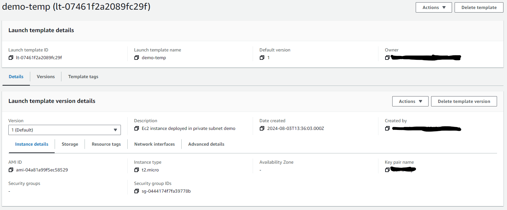

### Launch template creation steps
- Launch template name - required
- Template version description
- Application and OS Images (Amazon Machine Image) - required (ubuntu)
- Instance type (t2.micro)
- Key pair (login)
- create security groups with two inbound rules -  ssh/22, custom tcp/8000
- vpc
- Create launch template

