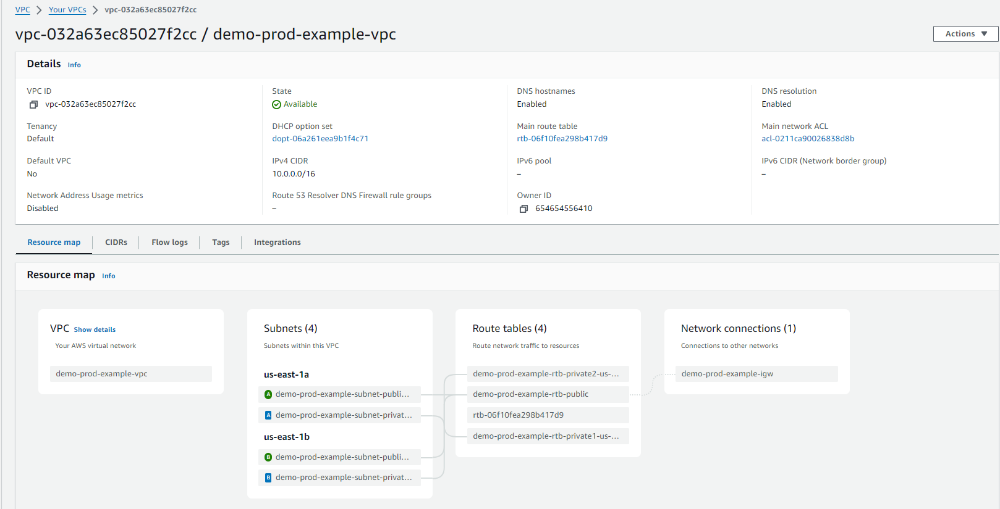
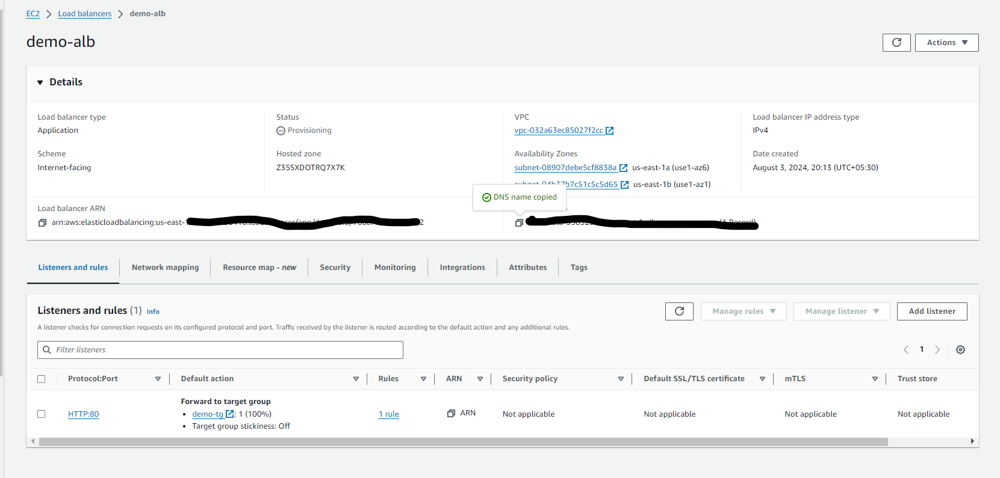
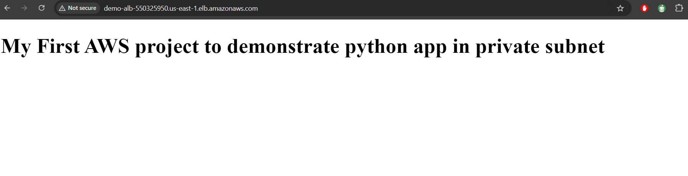

### Steps to create a VPC

- Choose Create VPC and select VPC and more in the VPC console. 
- In Name tag auto-generation, you can specify a prefix value for Name tags. 
- IPv4 CIDR block (default)
- Choose the number of Availability Zones (AZs) up to 3 (in this case using 2)
- The number of public and private subnet types changes based on the number of AZs and shows the total number of each subnet type it    will create
- Choose number of AZ in which to create NAT gateways (Note that there is a charge for each NAT gateway) (Not using in this project) 
- Create VPC 

- One create VPC

### Steps to create an EC2 Auto-scaling group
+ Step 1: Create a launch template
+ Step 2: Create a dual-instance Auto Scaling group
+ Step 3: Verify your Auto Scaling group

### Steps to create a Bastian host to access EC2 instances in private subnet
- Go to the EC2 Dashboard and click Launch Instance
- Choose 'Ubuntu' or any preferred AMI
- Select 't2.micro' instance type 
- Choose keypair(login)
- Select your VPC and public subnet
- Enable Auto-assign Public IP
- Create a new security group 
- Allow 'SSH' traffic from anywhere
- Review and launch the instance

### Steps to create an Application load balancer
- Firstly create a target group
- Choose target type as EC2 instances
- Choose Target group name
- Choose protocol as 'HTTP' and port '8000'
- Choose vpc 
- Choose instances to register the targets and include them as pending

- Choose Load balancer name
- Add target group to the load balancer
- Choose Protocol as 'HTTP' and port '80' 
- Create the load balancer
- Goto newly created load balancer
- Find listeners and add a new inbound rule to allow "HTTP' traffic from security tab
- Access the final app from hitting the 'dns name' of the load balancer on the browser

## Steps to access bastian host and EC2 servers in private subnet - app deployment process
- Using MobaXterm to access bastian host and EC2 servers
- To access bastian host - we need Public IP address of the bastian host
- Use this command to upload '.pem' file to bastian host : "scp -i /home/ubuntu/filename.pem /home/ubuntu/filename.pem ubuntu@<PublicIP>:/home/ubuntu" (This is the location in my pc)
- Use this command to confirm if file uploaded : <ls | grep "file-name">
- Now login to the bastian host using the command : "ssh -i ".pem file" ubuntu@<publicIP>"
- Use this command to check the file : "ls"
- Now login to the first private ec2 instance : "ssh -i ".pem file" ubuntu@<privateIP>"
- Use vim command to create a index.html file: "vim index.html" that will serve as an app
- Run this command to deploy an app : "python3 -m http.server 8000"
- Access the deployed app using the 'dns name' of the load balancer

 

